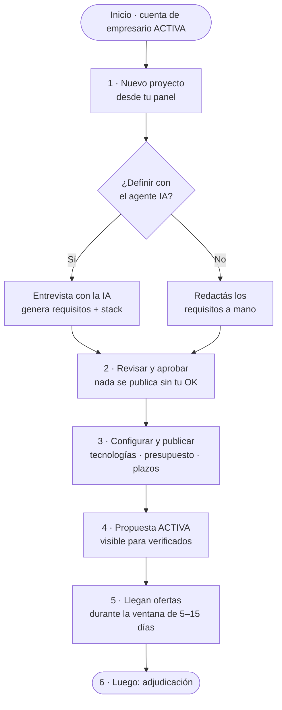

# Flujo — Publicar un proyecto (rol: Empresario)

> **Plataforma de Conexión de Talento Tecnológico FWD**
> Cómo un empresario crea y publica un proyecto, de principio a fin, y qué datos pide el formulario.

---

## Diagrama



---

## Paso a paso

### Antes de empezar
Necesitas tu cuenta de empresario con el **correo verificado** (`estado_cuenta = ACTIVA`). El empresario **no** requiere la validación de egresado FWD; eso aplica solo a estudiantes.

### 1 · Nuevo proyecto
Desde tu panel tocas **"Nuevo proyecto"**. Aquí se abre la bifurcación que define cómo armas los requisitos.

### 2 · Definir requisitos (dos caminos)
- **Con el agente de IA (recomendado):** le cuentas tu idea en lenguaje no técnico y te **entrevista con preguntas sucesivas** (objetivo, alcance, usuarios, tecnologías, plazo, presupuesto). Cuando junta lo suficiente, **genera los requerimientos estructurados + un stack sugerido y justificado**. La conversación se guarda y se puede reanudar.
- **A mano:** si ya tienes claro el alcance, redactas los requisitos directamente, sin IA.

### 3 · Revisar y aprobar
Veas el camino que veas, **nada se publica sin tu OK**: revisas lo generado (o lo tuyo), editas lo que quieras y lo apruebas. Este paso es tuyo, no de la IA.

### 4 · Configurar y publicar
Completas/confirmas los datos del proyecto (ver el formulario abajo) y eliges la **ventana de ofertas (5–15 días)**. Al publicar, la propuesta pasa a `ACTIVA`.

### 5 · Propuesta ACTIVA
El proyecto queda **visible para los estudiantes verificados**, que lo encuentran al explorar y filtrar (por tecnología, área, fecha, categoría).

### 6 · Llegan ofertas
Durante la ventana recibes **ofertas** (prototipo + propuesta de solución + precio) y notificaciones. Mientras no hayas adjudicado, puedes:
- **Editar** el proyecto → se **notifica a los oferentes** activos.
- **Pausar** o **cancelar** la propuesta.

> **Qué sigue (otra fase):** al vencer la ventana —o antes, si ya tienes un favorito— pasas a **adjudicar**: comparas ofertas (perfil, reputación, nivel), calificas cada una (1–5★) y eliges una. Si la ventana cierra **sin ofertas**, la propuesta se cierra sin adjudicar.

---

## Qué pide el formulario

> Criterio: pedir **lo mínimo** para que un estudiante pueda ofertar con criterio, sin un formulario tan largo que desincentive publicar.

### 1. Lo esencial
| Campo | Tipo | Obligatorio | Nota |
|---|---|:--:|---|
| Título del proyecto | texto corto (≤80) | Sí | claro y específico |
| Descripción / objetivo | textarea (mín. ~100 car.) | Sí | qué problema resuelve y qué espera recibir |
| Categoría (tipo de proyecto) | select | Sí | Web · Móvil · API/Backend · E-commerce · Dashboard · Landing · Automatización · Otro |
| Área de negocio / sector | select (catálogo) | Sí | el rubro: Fintech, Salud, Educación, Retail… |

### 2. Requisitos técnicos
| Campo | Tipo | Obligatorio | Nota |
|---|---|:--:|---|
| Tecnologías requeridas | multi-select (catálogo) + "sin preferencia" | Sí (≥1) | alimenta `tecnologia_propuesta` |
| Entregables esperados | checklist o textarea | Opcional | código, demo desplegada, repo, documentación |
| Nivel esperado | select | Opcional | recordá que los egresados FWD son junior |

### 3. Alcance económico
| Campo | Tipo | Obligatorio | Nota |
|---|---|:--:|---|
| Presupuesto | rango mín–máx + moneda (CRC/USD) o "a convenir" | Sí | |
| Modelo de pago | radio: monto fijo / por hora | Opcional | del alcance ampliado |
| Modalidad | radio: remoto / híbrido / presencial | Opcional | ya aparece en los filtros del front |

### 4. Plazos (¡son dos cosas distintas!)
| Campo | Tipo | Obligatorio | Nota |
|---|---|:--:|---|
| **Ventana de ofertas** | n.º de días (**5–15**) o fecha de cierre | Sí | cuánto tiempo estará **recibiendo ofertas** |
| **Plazo de entrega** | urgente / normal, o rango de días / fecha objetivo | Sí | para cuándo necesitas el trabajo **una vez adjudicado** |

> En la UI, pon una microayuda en cada uno ("cuánto tiempo recibes ofertas" vs "para cuándo lo necesitas"): es justo donde la gente se confunde.

### 5. IA y extras
| Campo | Tipo | Obligatorio | Nota |
|---|---|:--:|---|
| ¿Definido con el asistente de IA? | toggle (se marca solo si vino del agente) | Auto | |
| Adjuntos | file (PDF/imagen) | Opcional | brief, wireframes, documento de referencia |
| Visibilidad | radio: público / solo verificados | Opcional | por defecto solo ofertan los verificados |
| Confirmo que la información es veraz | checkbox | Sí | |

---

## Validación y UX
- **Validaciones:** ventana entre 5 y 15 días, presupuesto mín ≤ máx, descripción con mínimo de caracteres, al menos una tecnología o "sin preferencia".
- **Botones:** "Guardar borrador" (estado `BORRADOR`, no visible) y "Publicar" (pasa a `ACTIVA`).

## Seguridad — lo que el formulario NO debe enviar
El form solo manda los **datos de negocio**. Estos los fija el **servidor**, nunca el `req.body`:
- **Estado** → lo fija el servidor en `ACTIVA`.
- **Dueño** (`id_perfil_empresario`) → se toma del **token** del usuario autenticado.
- **Fechas calculadas** (creación, cierre de la ventana) → las calcula el backend.

> Esto evita *mass-assignment*: si el form pudiera mandar estos campos, alguien podría publicar a nombre de otro o crear un proyecto ya "adjudicado".

## Estados de la propuesta
```
BORRADOR → ACTIVA → (PAUSADA) → CERRADA   (al adjudicar o vencer)
                    └─────────→ CANCELADA (cancelada por el empresario/admin)
```

---

*Documento derivado de la suite de documentación FWD (ver 04 — Requerimientos funcionales, 08 — Flujos de usuario y 16 — Mapa de pantallas y UI).*
